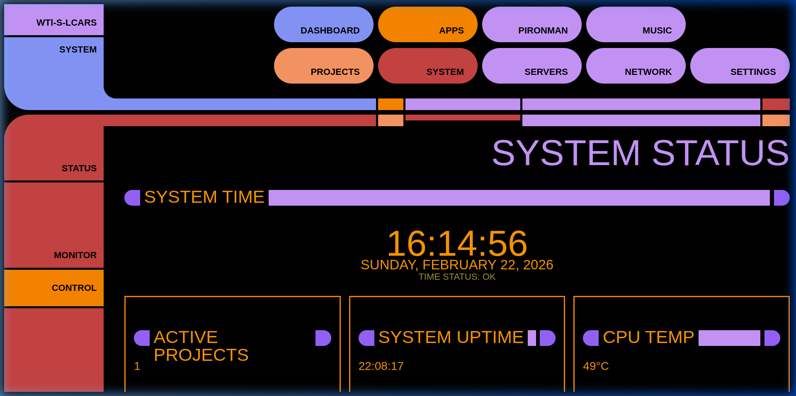
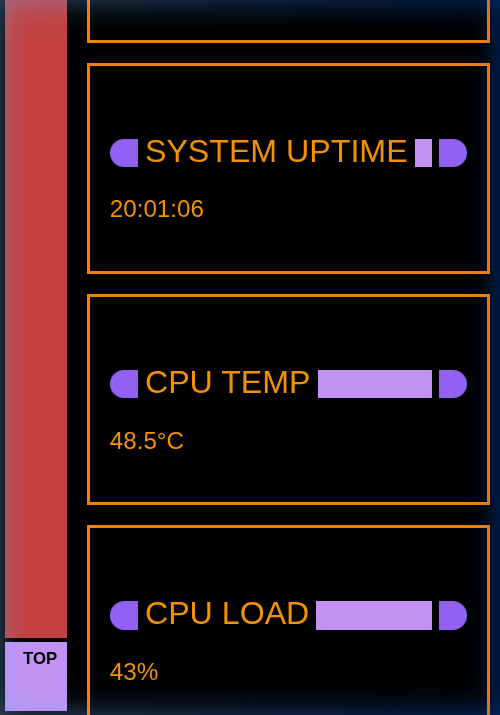
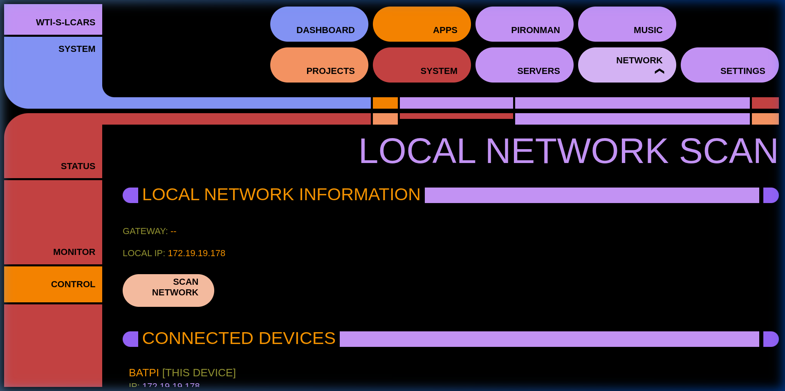

# WTl-S-LCARS (Wayne Tech Lab - Lab Core Access Retrieval System)

An immersive, fully-functional Star Trek LCARS-style web dashboard designed for homelabs, smart home monitoring, and server administration. Built with an HTML/ Vanilla JS frontend and a robust Python/Flask backend.

## Features
* **Nmap Subnet Scanner:** Active local network discovery with an authentic LCARS progress bar.
* **Service Status Monitoring:** Live status indicators for game servers (Minecraft) and media servers (Navidrome, Nextcloud).
* **System Metrics:** Real-time RAM, CPU, and temperature tracking for your host hardware.
* **Music Player Integration:** Control connected audio services directly from the dashboard.
* **Responsive Design:** Fluid layout that scales beautifully from wide desktop monitors down to mobile smartphones.
* **Standby Mode:** An elegant screensaver mode that activates during idle time to prevent screen burn-in.

## Screenshots

<p align="center">
  
  
</p>

## Architecture
* **Frontend:** Pure HTML, CSS (LCARS aesthetic), and Vanilla JavaScript caching mechanisms.
* **Backend:** Python 3, Flask, and Gunicorn providing RESTful APIs.
* **Server:** Designed to run behind an Nginx reverse proxy.

## Setup Instructions

### 1. Requirements
* A Linux host (tested on Ubuntu/Debian/Raspberry Pi OS)
* Nginx 
* Python 3 and `pip`
* `nmap` (required for the network scanner)

### 2. Backend Setup
Clone this repository and set up the Python backend as a systemd service.

```bash
cd backend
python3 -m venv venv
source venv/bin/activate
pip install -r requirements.txt
```

*(You will need to configure your local variables by moving `.env.example` to `.env`)*

### 3. Frontend Setup
Copy the frontend files (`index.html`, `/css/`, `/scripts/`, and `/assets/`) to your web root (e.g., `/var/www/html/`).

Configure Nginx to proxy `/api/` requests to your local Python backend running on port 5000. Ensure you increase the proxy timeouts to support the 30-second network sweeps:

```nginx
location /api/ {
    proxy_pass http://localhost:5000/;
    proxy_read_timeout 60s;
    proxy_connect_timeout 60s;
    proxy_send_timeout 60s;
}
```
